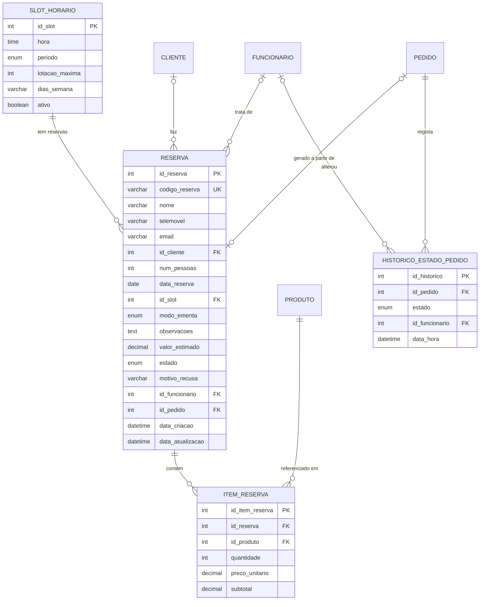

# Como completar o diagrama ER

**Tarefa C-02** · Estimativa: 1 h 30 · Data: 1 de setembro de 2026

O diagrama atual (`diagrama er projeto (4).pdf`) tem **12 tabelas** e cobre bem os pedidos. Falta a parte das reservas — que é justamente a que o Guilherme já construiu inteira no front-end.

**São 4 tabelas novas e 5 alterações pequenas a tabelas existentes.**

---

## Parte 1 — Alterações a tabelas que já tens

Despacha estas primeiro, são cinco minutos cada.

| Tabela | Alteração | Porquê |
|---|---|---|
| `PEDIDO` | **+ `numero_pedido`** · Varchar(20) · UQ, NOT NULL | É o código que se mostra ao cliente e se grita no balcão. O `id` da base de dados não serve: revela quantos pedidos existem e fica feio no ecrã |
| `PEDIDO` | **+ `data_atualizacao`** · Datetime · NOT NULL | Permite ao dashboard perguntar só "o que mudou desde a última vez?" em vez de puxar tudo de 10 em 10 segundos |
| `PRODUTO` | **+ `controla_stock`** · Boolean · NOT NULL | Faz sentido contar garrafas de cerveja. Não faz sentido contar picanhas grelhadas na hora. Sem este campo, ou controlas o stock de tudo ou de nada |
| `NOTIFICACAO` | **+ `estado`** · Enum(`pendente`,`enviado`,`falhou`) · NOT NULL | Emails falham. Com este campo podes reenviar; sem ele, perdes-te |
| `CATEGORIA` | **nada a acrescentar** | Tinha proposto um campo `grupo_ementa`, mas já não é preciso — ver a nota no fim |

---

## Parte 2 — As 4 tabelas novas

### 🕐 `SLOT_HORARIO`

Os horários que o restaurante abre para reserva.

| Restrição | Campo | Tipo |
|---|---|---|
| PK | `id_slot` | Integer |
| NOT NULL | `hora` | Time |
| NOT NULL | `periodo` | Enum('almoco','jantar') |
| NOT NULL | `lotacao_maxima` | Integer |
| NOT NULL | `dias_semana` | Varchar(20) |
| NOT NULL | `ativo` | Boolean |

**Porque é uma tabela e não valores fixos no código:** assim o administrador pode fechar os almoços de terça ou abrir um horário novo pelo back-office, sem ninguém mexer em código. É também mais uma funcionalidade para mostrar na apresentação.

`dias_semana` guarda algo como `2,3,4,5,6,7` (terça a domingo). `lotacao_maxima` fica na tabela mas **não é usado nesta versão** — está lá para quando quiserem ligar a verificação de lotação sem alterar a base de dados.

**Dados iniciais:** 12 slots — almoço às 12:00, 12:30, 13:00, 13:30, 14:00 e jantar às 19:30, 20:00, 20:30, 21:00, 21:30, 22:00, 22:30.

---

### 📅 `RESERVA`

| Restrição | Campo | Tipo |
|---|---|---|
| PK | `id_reserva` | Integer |
| UQ, NOT NULL | `codigo_reserva` | Varchar(20) |
| NOT NULL | `nome` | Varchar(120) |
| NOT NULL | `telemovel` | Varchar(20) |
| NULL | `email` | Varchar(150) |
| FK, NULL | `id_cliente` | Integer |
| NOT NULL | `num_pessoas` | Integer |
| NOT NULL | `data_reserva` | Date |
| FK, NOT NULL | `id_slot` | Integer |
| NOT NULL | `modo_ementa` | Enum('no_restaurante','pre_selecionada') |
| NULL | `observacoes` | Text |
| NULL | `valor_estimado` | Decimal(10,2) |
| NOT NULL | `estado` | Enum('pendente','confirmada','recusada','cancelada','concluida','nao_compareceu') |
| NULL | `motivo_recusa` | Varchar(255) |
| FK, NULL | `id_funcionario` | Integer |
| FK, NULL | `id_pedido` | Integer |
| NOT NULL | `data_criacao` | Datetime |
| NOT NULL | `data_atualizacao` | Datetime |

**Campos que ficam vazios nesta versão** e existem só para o futuro: `email`, `id_cliente`, `motivo_recusa`, `id_funcionario`, `id_pedido`. Criá-los agora custa nada; acrescentá-los depois, com dados reais na base de dados, obriga a migrações.

**`codigo_reserva`** é o que o cliente leva. Como as reservas não pedem email, este código é a única prova que ele fica a ter — algo como `RSV-7K2M9`.

---

### 🍽️ `ITEM_RESERVA`

A ementa pré-selecionada. Uma linha por produto escolhido.

| Restrição | Campo | Tipo |
|---|---|---|
| PK | `id_item_reserva` | Integer |
| FK, NOT NULL | `id_reserva` | Integer |
| FK, NOT NULL | `id_produto` | Integer |
| NOT NULL | `quantidade` | Integer |
| NOT NULL | `preco_unitario` | Decimal(10,2) |
| NOT NULL | `subtotal` | Decimal(10,2) |

**`preco_unitario` é o preço à data da reserva**, não o preço atual do produto. Mesma lógica do `ITEM_PEDIDO`: se subires o preço da picanha amanhã, a reserva de hoje continua a mostrar o valor que o cliente viu.

---

### 📊 `HISTORICO_ESTADO_PEDIDO`

Um registo por cada mudança de estado de um pedido.

| Restrição | Campo | Tipo |
|---|---|---|
| PK | `id_historico` | Integer |
| FK, NOT NULL | `id_pedido` | Integer |
| NOT NULL | `estado` | Enum('recebido','confirmado','em_preparacao','pronto','entregue','cancelado') |
| FK, NULL | `id_funcionario` | Integer |
| NOT NULL | `data_hora` | Datetime |

**É a tabela mais valiosa das quatro.** Sem ela sabes que um pedido está "pronto", mas não sabes quanto tempo demorou a lá chegar nem quem o mexeu. Com ela, tens **tempo médio de preparação** no dashboard — a estatística que mais impressiona numa apresentação, e que é impossível de calcular à posteriori.

---

## Parte 3 — As ligações a desenhar

| De | Para | Cardinalidade | Campo |
|---|---|---|---|
| `SLOT_HORARIO` | `RESERVA` | 1 : N | `id_slot` |
| `RESERVA` | `ITEM_RESERVA` | 1 : N | `id_reserva` |
| `PRODUTO` | `ITEM_RESERVA` | 1 : N | `id_produto` |
| `CLIENTE` | `RESERVA` | 0..1 : N | `id_cliente` *(futuro)* |
| `FUNCIONARIO` | `RESERVA` | 0..1 : N | `id_funcionario` *(futuro)* |
| `PEDIDO` | `RESERVA` | 0..1 : 0..1 | `id_pedido` *(futuro)* |
| `PEDIDO` | `HISTORICO_ESTADO_PEDIDO` | 1 : N | `id_pedido` |
| `FUNCIONARIO` | `HISTORICO_ESTADO_PEDIDO` | 0..1 : N | `id_funcionario` |

**Regra para todas as chaves estrangeiras:** `ON DELETE RESTRICT`. Apagar uma categoria nunca pode apagar o histórico de pedidos. O que se apaga desativa-se com `ativo = false`, não se elimina.

---

## Parte 4 — Para colar diretamente numa ferramenta

### dbdiagram.io (DBML)

```dbml
Table slot_horario {
  id_slot        integer  [pk, increment]
  hora           time     [not null]
  periodo        varchar  [not null, note: "almoco | jantar"]
  lotacao_maxima integer  [not null, default: 40]
  dias_semana    varchar(20) [not null, note: "ex: 2,3,4,5,6,7"]
  ativo          boolean  [not null, default: true]
}

Table reserva {
  id_reserva       integer     [pk, increment]
  codigo_reserva   varchar(20) [unique, not null]
  nome             varchar(120)[not null]
  telemovel        varchar(20) [not null]
  email            varchar(150)
  id_cliente       integer
  num_pessoas      integer     [not null]
  data_reserva     date        [not null]
  id_slot          integer     [not null]
  modo_ementa      varchar     [not null, note: "no_restaurante | pre_selecionada"]
  observacoes      text
  valor_estimado   decimal(10,2)
  estado           varchar     [not null, default: "pendente"]
  motivo_recusa    varchar(255)
  id_funcionario   integer
  id_pedido        integer
  data_criacao     datetime    [not null]
  data_atualizacao datetime    [not null]
}

Table item_reserva {
  id_item_reserva integer       [pk, increment]
  id_reserva      integer       [not null]
  id_produto      integer       [not null]
  quantidade      integer       [not null]
  preco_unitario  decimal(10,2) [not null]
  subtotal        decimal(10,2) [not null]
}

Table historico_estado_pedido {
  id_historico   integer  [pk, increment]
  id_pedido      integer  [not null]
  estado         varchar  [not null]
  id_funcionario integer
  data_hora      datetime [not null]
}

Ref: reserva.id_slot                  > slot_horario.id_slot
Ref: reserva.id_cliente               > cliente.id_cliente
Ref: reserva.id_funcionario           > funcionario.id_funcionario
Ref: reserva.id_pedido                - pedido.id_pedido
Ref: item_reserva.id_reserva          > reserva.id_reserva
Ref: item_reserva.id_produto          > produto.id_produto
Ref: historico_estado_pedido.id_pedido      > pedido.id_pedido
Ref: historico_estado_pedido.id_funcionario > funcionario.id_funcionario
```

### Mermaid



---

## Nota: as categorias mudaram

Nos documentos anteriores propus um campo `grupo_ementa` na tabela `CATEGORIA`, porque as categorias do menu de pedidos (Hambúrgueres, Carnes, Acompanhamentos…) não coincidiam com as 4 páginas da pré-seleção de reservas.

O Guilherme resolveu isso sozinho: no `reservas.js` ele usou **exatamente 4 categorias** — 🥗 Entradas · 🥩 Pratos Principais · 🍺 Bebidas · 🍮 Sobremesas. Como coincidem com os quatro grupos, **o campo deixa de ser preciso**. As categorias *são* os grupos.

Usa estas quatro na tabela `CATEGORIA`. Menos um campo, menos uma complicação.

---

## Checklist

- [ ] `PEDIDO`: acrescentar `numero_pedido` e `data_atualizacao`
- [ ] `PRODUTO`: acrescentar `controla_stock`
- [ ] `NOTIFICACAO`: acrescentar `estado`
- [ ] Criar `SLOT_HORARIO`
- [ ] Criar `RESERVA`
- [ ] Criar `ITEM_RESERVA`
- [ ] Criar `HISTORICO_ESTADO_PEDIDO`
- [ ] Desenhar as 8 ligações
- [ ] Confirmar `ON DELETE RESTRICT` em todas as FK
- [ ] Exportar para `database/` e apagar as versões antigas do diagrama
- [ ] Commit: `git add database/ && git commit -m "Completa diagrama ER com reservas"`

**Total no fim: 16 tabelas.**
